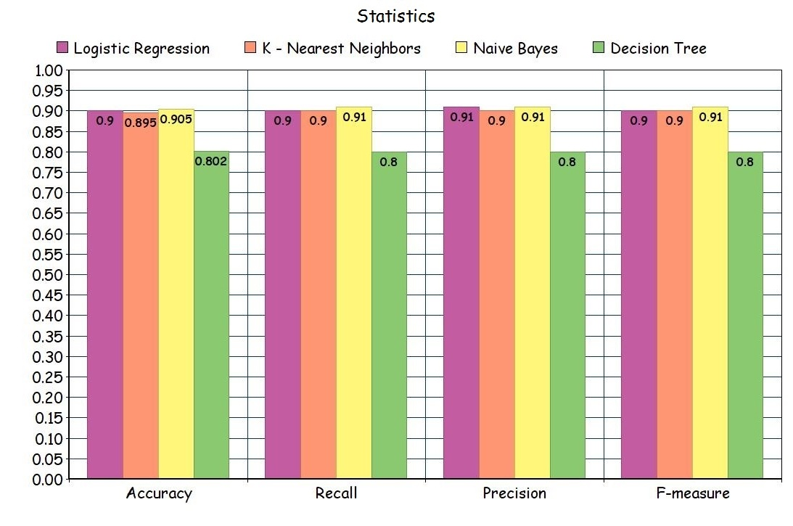

# Статистика
Данный файл содержит в себе сравнение результатов работы исследуемых методов классификации.

Были исследованы четыре метода классификации:\
**1.** **Logistic Regression.** Метод логистической регрессии основан на линейном дискрименанте Фишера. Иначе говоря, данный классификатор пытается максимально точно линейно разделить документы по бинарной шкале\
**2.** **K-Nearest Neighbors.** Классификатор, использующий метод К-ближайших соседей определяет для поступившего документа самую распространенную тональность среди К ближайших к нему соседей, основываясь на их признаках (весах по N-граммам).\
**3.** **Naive Bayes.** Данный метод классификации основывается на теореме Байеса о вероятностях.\
**4.** **Decision Tree.** Дерево решений строится на основе бинарного дерева и значимости признаков.

[← Подсчет тональности](./count_tonal.md)